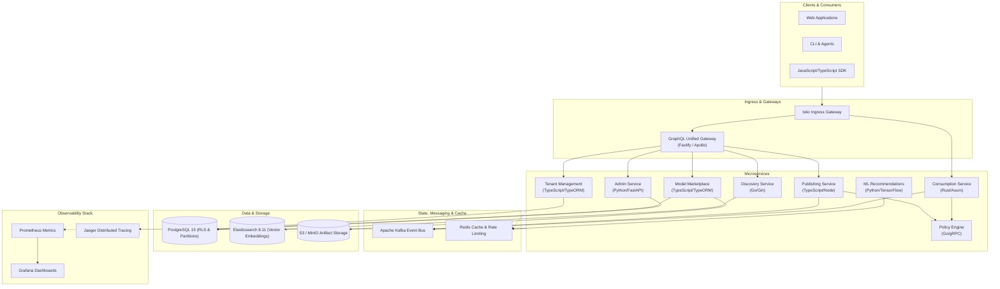

# CortexOps

> AI-powered cloud-native platform for AI model lifecycle, deployment, governance, and inference operations.

[](https://github.com/roshanrameshhub/CortexOps/actions)
[](LICENSE)
[](https://github.com/roshanrameshhub/CortexOps)
[](https://github.com/roshanrameshhub/CortexOps)

---

## Overview

**CortexOps** is an enterprise-grade, cloud-native platform designed to orchestrate the end-to-end lifecycle of AI models and LLM services. Modern organizations deploying AI models at scale face severe operational hurdles: fragmented model discovery, lack of centralized governance, inconsistent inference metering, complex multi-tenant quota enforcement, and untracked fine-tuning lineages.

CortexOps solves these challenges by providing:
- **Intelligent Discovery**: Semantic vector search (768-dimensional embeddings via Elasticsearch) and hybrid recommendation models to discover AI services.
- **Automated Publishing & Governance**: Multi-phase validation pipelines checking OpenAPI 3.1 specifications, policy compliance, and version lifecycle.
- **Ultra-Low Latency Inference & Routing**: Zero-copy request routing with token-level metering and Redis-backed rate limiting.
- **Deep Multi-Tenancy**: Tenant isolation using PostgreSQL Row-Level Security (RLS), multi-tier quota management (API calls, storage, tokens), and cross-tenant resource sharing policies.
- **Model Lineage & Provenance**: DAG-based tracking of base models, fine-tuned datasets, hyperparameters, training runs, and automated benchmark evaluations (MMLU, TruthfulQA, HellaSwag).
- **Chaos & Resilience Engineering**: Integrated chaos validation suites testing cluster failure modes and latency degradation.

---

## Key Features

Every feature listed below is implemented in the codebase:

### AI & ML Operations
- **Recommendation Engine (`services/ml-recommendations`)**: Advanced recommendation models built with TensorFlow and scikit-learn supporting SVD, ALS, NMF, Neural Collaborative Filtering (NCF), Wide & Deep, and Deep & Cross Networks (DCN). Includes A/B testing infrastructure and sub-100ms inference caching.
- **Automated Model Evaluation (`services/model-marketplace`)**: Evaluation runner supporting standard benchmark evaluation suites (MMLU, HellaSwag, TruthfulQA) and automated quality scoring.

### Model Lifecycle & Registry
- **Publishing Pipeline (`services/publishing`)**: 10-phase automated validation pipeline encompassing schema validation, OpenAPI 3.1 verification, policy compliance, security scanning, semantic versioning, and event broadcast.
- **Model Registry & Provenance (`services/model-marketplace`)**: Centralized artifact metadata tracking, S3/MinIO artifact storage adapters, DAG-based model lineage tracking, and data provenance auditing.
- **Lifecycle Agents (`agents/`)**: Specialized autonomous agents for deprecation lifecycle management (`agents/deprecation-agent`) and distribution packaging (`agents/marketplace-packaging`).

### Gateway & High-Performance Consumption
- **Unified GraphQL Gateway (`services/graphql-gateway`)**: Fastify- and Apollo Server-powered federated GraphQL gateway aggregating Admin, Publishing, Discovery, and Consumption APIs with dataloader caching, query complexity limits, and depth limiting.
- **High-Performance Consumption Routing (`services/consumption`)**: High-throughput Rust/Axum proxy service providing token-level usage tracking, cost calculations, Argon2 key verification, and sub-100ms request dispatch.

### Governance, Security & Multi-Tenancy
- **Policy Enforcement Engine (`services/policy-engine`)**: Go-based gRPC policy engine enforcing regulatory requirements, data residency constraints, security baselines, and pricing policies.
- **Multi-Tenant Isolation (`services/tenant-management`)**: PostgreSQL Row-Level Security (RLS) policies, configurable tenant tiers (`FREE`, `STARTER`, `PROFESSIONAL`, `ENTERPRISE`), and dynamic quota enforcement (`BLOCK`, `THROTTLE`, `ALERT`).
- **Administrative Operations (`services/admin`)**: FastAPI service managing multi-level approval workflows, operational health monitoring, pandas-powered analytics aggregation, and Role-Based Access Control (RBAC).

### Event-Driven Architecture & Reliability
- **Asynchronous Event Processing**: Kafka event streaming for service lifecycle events (`service.published`, `service.consumed`, audit logs, telemetry).
- **Chaos Engineering Suite (`chaos-engineering`)**: Comprehensive resilience scenarios targeting pod failure, network delay, packet corruption, CPU stress, and disaster recovery failover.

---

## Architecture

CortexOps employs an asynchronous, event-driven microservices architecture communicating via REST, gRPC, GraphQL, and Apache Kafka.



---

## Technology Stack

| Layer | Technologies |
| :--- | :--- |
| **API Gateways & SDKs** | GraphQL (Apollo Server v4), Fastify, TypeScript SDK (`sdks/javascript`) |
| **Backend Microservices** | Node.js (v20+), Go (v1.21+), Rust (2021 edition), Python (v3.9+) |
| **Web Frameworks** | Express, Fastify, Gin (Go), Axum (Rust), FastAPI (Python) |
| **Databases** | PostgreSQL 15 (with Row-Level Security), Elasticsearch 8.11 (Vector Search) |
| **Caching & In-Memory** | Redis 7 (Token Bucket rate limiting, session cache) |
| **Messaging & Events** | Apache Kafka 7.5, Zookeeper |
| **AI / ML & Benchmarks** | TensorFlow 2.15, PyTorch 2.1, scikit-learn, MMLU / HellaSwag evaluation benchmarks |
| **Object Storage** | AWS S3 / MinIO (model weights, datasets, schemas) |
| **Infrastructure as Code** | Terraform (AWS EKS, RDS, MSK, VPC modules) |
| **Containers & Orchestration** | Docker (multi-stage builds), Docker Compose, Kubernetes 1.28+, Kustomize, Istio Gateway |
| **CI / CD** | GitHub Actions workflows, Google Cloud Build |
| **Observability** | Prometheus, Grafana, OpenTelemetry, Jaeger Tracing, Pino, Winston, Zap |
| **Testing** | Jest, Supertest, Pytest, Go testing, Cargo test, k6 performance testing, Chaos Mesh / Litmus |
| **Security** | Argon2id, JWT (RS256/HS256), gRPC mTLS, PostgreSQL RLS, RBAC |
| **Cloud Targets** | Google Cloud Run, Google Kubernetes Engine (GKE), AWS EKS |

---

## Repository Structure

```
CortexOps/
├── .github/workflows/          # GitHub Actions CI/CD, testing, & publishing pipelines
├── agents/                     # Specialized autonomous operational agents
│   ├── deprecation-agent/      # Service and model deprecation lifecycle agent
│   ├── ecosystem-agent/        # Agent ecosystem infrastructure definitions
│   └── marketplace-packaging/  # Package and distribution agent
├── chaos-engineering/          # Litmus and Chaos Mesh resilience test scenarios
├── config/                     # Environment configuration manifests (dev, staging, prod)
├── crates/
│   └── llm-infra/              # Shared Rust infrastructure utilities (tracing, config, cache)
├── docs/                       # Comprehensive architectural and technical documentation
│   ├── ARCHITECTURE.md         # Deep-dive system architecture specification
│   ├── SECURITY.md             # Security architecture, threat models, and controls
│   └── deployment-guide.md     # Multi-environment deployment runbook
├── infrastructure/             # Infrastructure definitions
│   ├── cloudrun/               # Google Cloud Run service definitions
│   ├── database/               # Database migrations and seed fixtures
│   ├── kubernetes/             # Production Kubernetes manifests and Kustomize base
│   ├── prometheus/             # Prometheus scrape configuration
│   ├── sql/                    # PostgreSQL initialization schema
│   └── terraform/              # Terraform modules (EKS, RDS, MSK, Redis, VPC)
├── marketplace-benchmarks/     # Benchmarking framework and TypeScript CLI wrappers
├── packages/                   # Monorepo shared packages
│   ├── agentics-contracts/     # Zod schema definitions and agent contracts
│   └── infra/                  # Shared TypeScript utilities (logging, tracing, retry)
├── plans/                      # SPARC specification, architecture, and roadmap documents
├── scripts/                    # Automation, deployment, release, and verification scripts
├── sdks/
│   └── javascript/             # Official TypeScript/JavaScript client SDK
├── services/                   # Core platform microservices
│   ├── admin/                  # Admin & health management service (FastAPI)
│   ├── consumption/            # High-throughput consumption routing service (Rust/Axum)
│   ├── discovery/              # Semantic search and discovery service (Go/Gin)
│   ├── graphql-gateway/        # Unified GraphQL API gateway (Apollo/Fastify)
│   ├── ml-recommendations/     # Advanced ML recommendation engine (Python/TensorFlow)
│   ├── model-marketplace/      # Model registry and provenance service (Node/TypeORM)
│   ├── policy-engine/          # Policy evaluation engine (Go/gRPC)
│   ├── publishing/             # 10-phase publishing pipeline service (Node/Express)
│   └── tenant-management/      # Multi-tenant quota and isolation service (Node/TypeORM)
├── src/
│   └── unified-service/        # Cloud Run serverless entrypoint combining agent routes
├── tests/                      # Global test suites
│   ├── e2e/                    # End-to-end integration workflows with Docker Compose
│   └── performance/            # k6 load, stress, and spike test scenarios
├── .env.example                # Central environment variable template
├── Cargo.toml                  # Root Cargo workspace manifest
├── Dockerfile                  # Production container definition for unified Cloud Run deployment
├── docker-compose.yml          # Local infrastructure stack orchestrator
├── Makefile                    # Build, test, lint, and operations targets
└── package.json                # Root workspace configuration and npm scripts
```

---

## Local Development

### Prerequisites
- **Node.js**: `v20.0.0` or higher
- **npm**: `v10.0.0` or higher
- **Docker & Docker Compose**: Docker 24+ and Compose v2
- **Python** *(optional, for admin & ML services)*: Python 3.9+
- **Go** *(optional, for discovery & policy engine)*: Go 1.21+
- **Rust** *(optional, for consumption service)*: Rust 1.70+

### 1. Environment Configuration
Copy the root `.env.example` file:
```bash
cp .env.example .env
```
Update configuration values in `.env` as appropriate for your local environment.

### 2. Start Infrastructure Dependencies
Spin up PostgreSQL, Redis, Elasticsearch, Kafka, Zookeeper, and Jaeger:
```bash
docker compose up -d postgres redis elasticsearch kafka jaeger
```

### 3. Database Initialization & Migrations
The PostgreSQL container automatically runs `infrastructure/sql/init.sql` upon first startup. To run microservice migrations manually:
```bash
npm run migrate:up
```

### 4. Running Backend Services
You can run services individually or collectively:
- **Publishing Service**:
  ```bash
  npm run dev:publishing
  ```
- **Admin Service**:
  ```bash
  npm run dev:admin
  ```
- **GraphQL Gateway**:
  ```bash
  npm run build:graphql-gateway && npm run dev --workspace=services/graphql-gateway
  ```
- **All Configured Workspaces**:
  ```bash
  npm run dev
  ```

### 5. Running SDKs & Client Libraries
To build and watch the JavaScript/TypeScript SDK:
```bash
npm run build:sdk
```

### 6. Running Tests
- **All Workspace Unit Tests**:
  ```bash
  npm test
  ```
- **End-to-End Test Suite**:
  ```bash
  npm run test:e2e
  ```
- **Performance Benchmarks** (via k6):
  ```bash
  cd tests/performance && npm test
  ```

---

## Docker

CortexOps provides multi-stage, hardened Docker images:
- **Local Multi-Service Orchestration**:
  ```bash
  docker compose up -d
  docker compose ps
  docker compose logs -f
  docker compose down
  ```
- **Unified Cloud Run Container**:
  ```bash
  docker build -t cortexops:latest .
  ```
The unified container runs as a non-privileged `marketplace` user with built-in health checks on `/health`.

---

## Kubernetes

Kubernetes manifests are located in `infrastructure/kubernetes/`:
- **Base Components**: Namespace, ConfigMap, StorageClasses, StatefulSets (PostgreSQL, Redis, Elasticsearch, Kafka), Deployments (Admin, Consumption, Discovery, Publishing), Istio VirtualServices.
- **Kustomize Deployment**:
  To deploy the base stack to a target Kubernetes cluster:
  1. Create your secrets file from the template:
     ```bash
     cp infrastructure/kubernetes/base/secrets.example.yaml infrastructure/kubernetes/base/secrets.yaml
     # Update secrets.yaml with production credentials
     ```
  2. Apply the Kustomize overlay:
     ```bash
     kubectl apply -k infrastructure/kubernetes/base --load-restrictor LoadRestrictionsNone
     ```

---

## Helm

CortexOps is designed around **Kubernetes native manifests and Kustomize overlays**. Helm charts are currently not bundled; standard deployments use `kubectl apply -k infrastructure/kubernetes/base`.

---

## Terraform

Terraform configurations are located in `infrastructure/terraform/`:
- **Modules**:
  - AWS VPC with public, private, and database subnets.
  - AWS EKS cluster with autoscaling node groups (`general`, `compute`, `memory`).
  - AWS RDS Multi-AZ PostgreSQL instance.
  - AWS ElastiCache Redis cluster.
  - AWS MSK (Managed Streaming for Apache Kafka) cluster.
  - GCP and Azure provider definitions for multi-cloud deployments.
- **Usage**:
  ```bash
  cd infrastructure/terraform
  terraform init
  terraform plan -var="environment=dev"
  terraform apply -var="environment=dev"
  ```

---

## Ansible

Ansible is not utilized in this project. Cluster provisioning and container runtime configurations are handled declaratively via Terraform, Docker Compose, and Kubernetes manifests.

---

## CI/CD

Continuous Integration and Continuous Delivery are implemented using **GitHub Actions** and **Google Cloud Build**:
- **GitHub Actions (`.github/workflows/`)**:
  - `ci-cd-pipeline.yaml`: Comprehensive pipeline covering Trivy vulnerability scanning, Snyk checks, OWASP dependency scans, multi-language testing (Node, Go, Rust), and multi-environment deployment.
  - `ci-cd.yml`: Service container build and deployment pipeline.
  - `e2e-tests.yml`: Ephemeral microservices integration test suite with Docker Compose.
  - `npm-publish.yml`: Automated SDK and package release workflow.
  - `pr-validation.yml`: Fast PR validation checking linting, formatting, and unit tests.
  - `performance-tests.yml`: Automated k6 load and stress validation.
- **Google Cloud Build (`cloudbuild.yaml`)**:
  - Multi-tag container builds (`commit-sha`, `latest`, `env`).
  - Automated deployment to Google Cloud Run with Secret Manager integration.

---

## Observability

CortexOps includes a complete observability stack:
- **Metrics**: Prometheus instrumentation across all services exposing endpoints on `/metrics`. Preconfigured scraping in `infrastructure/prometheus/prometheus.yml`.
- **Dashboards**: Grafana provisioning (`infrastructure/grafana/`) with automated datasource configuration.
- **Distributed Tracing**: OpenTelemetry SDK integration across TypeScript, Go, and Rust services streaming spans to Jaeger (`http://localhost:16686`).
- **Structured Logging**: JSON logging using Pino (TypeScript), Winston, Zap (Go), and Tracing (Rust) with correlation ID propagation.

---

## Security

CortexOps adheres to strict security standards:
- **Authentication**: JWT authentication with configurable expiration and OAuth2/Keycloak integration support.
- **Password & Key Security**: Argon2id cryptographic hashing for administrative credentials and API keys.
- **Data Protection & Multi-Tenancy**: PostgreSQL Row-Level Security (RLS) ensures complete data separation across tenant boundaries.
- **Policy Enforcement**: Policy engine validates data residency, compliance, and pricing before requests are executed.
- **Vulnerability Management**: Continuous scanning via Trivy, OWASP Dependency-Check, and Snyk in CI.
- **Audit Trails**: Immutable audit logs streamed to Kafka topics (`cortexops.audit.logs`) and persisted in PostgreSQL.

---

## Testing

The codebase includes comprehensive test suites across multiple frameworks:
- **Unit & Integration Tests**:
  - TypeScript/Node: Jest (`services/publishing`, `services/graphql-gateway`, `services/tenant-management`, `services/model-marketplace`).
  - Python: Pytest (`services/admin`, `services/ml-recommendations`).
  - Go: Standard Go test framework (`services/discovery`, `services/policy-engine`).
  - Rust: Cargo test and Criterion benchmarks (`services/consumption`, `crates/llm-infra`).
- **End-to-End Tests**:
  - Workflow tests located in `tests/e2e/workflows/` simulating full publishing, discovery, and consumption cycles.
- **Performance Benchmarks**:
  - k6 load tests in `tests/performance/scenarios/` covering latency, spike, soak, and stress scenarios.
- **Chaos Engineering**:
  - Automated resilience experiments in `chaos-engineering/` validating zero-downtime tolerance.

---

## Configuration

All configuration is externalized via environment variables. See [`.env.example`](.env.example) for a complete list of supported variables with safe default placeholders.

> **Security Note**: Never commit actual `.env` files or credentials into version control. Use Kubernetes Secrets, Google Secret Manager, or AWS Secrets Manager in production.

---

## Deployment

CortexOps supports three production deployment strategies:
1. **Google Cloud Run**: Serverless container deployment using `cloudbuild.yaml` and `Dockerfile`.
2. **Kubernetes (EKS / GKE)**: Declarative multi-service deployment using manifests in `infrastructure/kubernetes/base`.
3. **Docker Compose**: Containerized multi-service deployment for edge or local server environments using `docker-compose.yml`.

---

## Project Status

### Implemented
- Discovery Service with Elasticsearch vector embeddings and fuzzy search.
- 10-phase Publishing Service with OpenAPI 3.1 verification.
- High-throughput Consumption Service in Rust with token-level metering and rate limiting.
- Admin Service with health checks, user management, and approval workflows.
- ML Recommendations Service with NCF, Wide & Deep, and DCN models.
- Multi-tenancy service with PostgreSQL RLS and quota enforcement.
- Fine-tuned Model Marketplace with DAG lineage tracking and automated evaluations.
- Unified GraphQL API Gateway with Apollo Server.
- JavaScript/TypeScript SDK with automatic retries and full typing.
- Docker Compose, Kubernetes manifests, and Terraform infrastructure modules.
- Chaos engineering test scenarios.

### Partially Implemented
- S3/MinIO binary weight storage adapter (mock adapters provided for local development).
- Cross-region multi-cloud database synchronization.
- Automated Kubernetes HPA tuning based on custom inference metrics.

### Planned
- Dedicated visual web frontend dashboard for tenant administration.
- Distributed fine-tuning orchestrator for edge inference nodes.
- Real-time model drift detection and automatic re-training triggers.

---

## Roadmap

- **Phase 1 (Current - v1.1.0)**: Production-ready core microservices, multi-tenancy, GraphQL gateway, and CI/CD pipelines.
- **Phase 2 (v1.2.0)**: Advanced cost-optimization recommendations, real-time model drift detection, and enhanced analytics.
- **Phase 3 (v2.0.0)**: Fine-tuning as a Service (FTaaS), automated hyperparameter search, and multi-cloud serverless inference mesh.

---

## Contributing

We welcome community contributions! Please review our [Contributing Guidelines](CONTRIBUTING.md) and [Security Policy](SECURITY.md) before submitting Pull Requests.

---

## License

This project is licensed under the Apache License 2.0 / MIT License - see the [LICENSE](LICENSE) file for details.

---

## Acknowledgements

- Built with the **SPARC methodology** (Specification, Pseudocode, Architecture, Refinement, Completion).
- Implemented using **Claude Flow Swarm** orchestration.
- Originally developed as the LLM Marketplace Platform by the LLM Marketplace Team.
